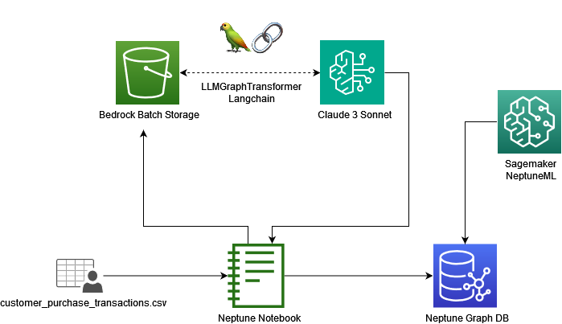

# Utilizing Generative AI to build Fraud Graphs utilized for Credit Card Fraud Use Cases via GNN

## Overview

This project demonstrates a comprehensive pipeline for creating a fraud detection knowledge graph using Amazon Bedrock and LangChain. The pipeline leverages advanced technologies to process credit card transaction data, generate a knowledge graph, and perform machine learning-based fraud detection.

### Use Case
Fraud detection is a critical challenge that spans various industries, from finance and e-commerce to telecommunications. As transactions and data sources continue to grow in volume, traditional rule-based systems and machine learning models often struggle to keep up with the complexity and ever-evolving nature of fraud patterns.

### Current Challenges 
1. Increased volumes for transactions and data sources
2. Real-Time Detection Requirements
3. Regulatory Compliance and Privacy Laws
4. Difficulty in identifying patterns and anomalies
5. Limited resources of skilled fraud analytics and data scientists

## Solution

The pipeline consists of the following main steps:
1. Data Preparation: Preprocessing of credit card transaction data
2. Knowledge Graph Generation: Using Amazon Bedrock with Claude 3 Sonnet via LangChain LLMGraphTransformer library.
3. Graph Database Population: Loading data into Amazon Neptune
4. Machine Learning: Utilizing Neptune ML with Graph Neural Networks (GNNs)
5. Fraud Detection: Performing inferences on the graph to predict fraudulent transactions



As opposed to inductive inference where new data is added to a dynamic graph we use transductive inference to determine whether a transaction is fraudulent. During the training process, Neptune ML pre-computes and stores a model prediction for every node in the graph. Then, this can be looked up quickly when queried. 

We based our code off of the following reference notebook: https://github.com/aws/graph-notebook/blob/main/src/graph_notebook/notebooks/03-Neptune-ML/03-Sample-Applications/03-Real-Time-Fraud-Detection-Using-Inductive-Inference.ipynb

## AWS Services Used

- **Amazon Bedrock**: Used for generating the knowledge graph structure from transaction data
- **Amazon Neptune**: Graph database for storing and querying the knowledge graph
- **Neptune ML**: Machine learning capabilities integrated with Neptune for training GNNs and performing fraud detection

## Data Processing and Knowledge Graph Generation

1. **Data Preparation**:
   - Load and preprocess credit card transaction data (CSV format)
   - Create input batches for Bedrock processing

2. **Knowledge Graph Generation**:
   - Utilize Amazon Bedrock with Claude 3 Sonnet model
   - Process data batches in parallel using Bedrock batch inference jobs
   - Generate nodes and relationships for the knowledge graph

## Neptune ML Process and GNNs

1. **Data Export**: Prepare graph data for ML processing
2. **Data Processing**: Set up and run data processing jobs
3. **Model Training**: Train GNN models for fraud detection
4. **Endpoint Creation**: Deploy trained models for inference
5. **Inference**: Perform predictions on the graph to identify potential fraudulent transactions

## Prerequisites

- AWS account with access to:
  - Amazon Bedrock
  - Amazon Neptune
  - Neptune ML
- Python 3.x
- IAM roles and permissions for accessing AWS services
- Familiarity with graph databases and machine learning concepts

## Setup and Installation

1. Set up AWS credentials and permissions
2. Install required Python libraries:
   ```
   pip install boto3 gremlinpython tqdm langchain langchain_experimental nest_asyncio
   ```
3. Clone this repository:
   ```
   git clone https://github.com/aws-samples/Utilizing-Generative-AI-to-build-Fraud-Graphs-utilized-for-Credit-Card-Fraud-Use-Cases-via-GNN.git
   cd Utilizing-Generative-AI-to-build-Fraud-Graphs-utilized-for-Credit-Card-Fraud-Use-Cases-via-GNN
   ```
4. Set up Amazon Neptune cluster using the CloudFormation template:
   https://docs.aws.amazon.com/neptune/latest/userguide/machine-learning-quick-start.html


## Usage Guide

1. Open the main notebook in Jupyter or your preferred notebook environment
2. Follow these steps sequentially:
   a. Data Preparation
   b. Knowledge Graph Generation
   c. Loading Data into Neptune
   d. Neptune ML Setup
   e. Model Training and Deployment
   f. Fraud Detection Inference
3. Execute each cell, following the comments and instructions provided
4. Analyze the results and visualize the fraud detection outcomes

## Project Structure

- `main_notebook.ipynb`: Main pipeline execution notebook
- `neptune_ml_utils.py`: Utility functions for Neptune ML operations
- `data/`: Directory containing input transaction data
- `output/`: Directory for storing generated knowledge graph data

## Customization Options

- Modify the input data source to include additional transaction features
- Adjust the knowledge graph schema to capture different relationships
- Fine-tune ML model configurations for improved fraud detection:
  - Modify GNN architecture
  - Adjust hyperparameters
  - Experiment with different feature encodings

## Interpreting and Using Results

1. Analyze fraud detection outcomes:
   - Review predicted probabilities for each transaction
   - Examine patterns in flagged fraudulent transactions
2. Visualize results using Neptune's built-in visualization tools
3. Export results for further analysis or integration with other systems

## Limitations and Future Improvements

Current limitations:
- Scalability for extremely large datasets
- Limited to credit card transaction data

Potential improvements:
- Incorporate real-time streaming data processing
- Integrate additional data sources (e.g., customer profiles, merchant information)
- Implement more advanced GNN architectures
- Develop a user-friendly interface for non-technical users

## Troubleshooting

If you encounter issues:

1. Enable model access on Bedrock
2. Check AWS service quotas and limits
3. Verify IAM roles and permissions
4. Ensure all required libraries are installed and up-to-date
5. Review CloudWatch logs for detailed error messages
6. Consult AWS documentation for service-specific troubleshooting guides

For persistent issues, please open an issue in the project repository or contact AWS support.

## Important Notes

- Be aware of the costs associated with using Amazon Bedrock, Neptune, and Neptune ML
- The notebook includes steps to clean up resources (e.g., deleting endpoints) to avoid unnecessary charges
- Regularly monitor your AWS usage and costs

## Contributing

Contributions to improve the pipeline are welcome. Please follow these steps:
1. Fork the repository
2. Create a new branch for your feature
3. Commit your changes
4. Push to the branch
5. Create a new Pull Request

## License

This project is licensed under the MIT License - see the LICENSE file for details.

Make sure you have model access on Bedrock
Check AWS service quotas and limits
Verify IAM permissions
Review the AWS CloudWatch logs for detailed error messages
